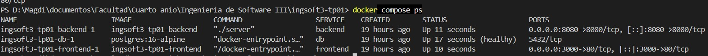
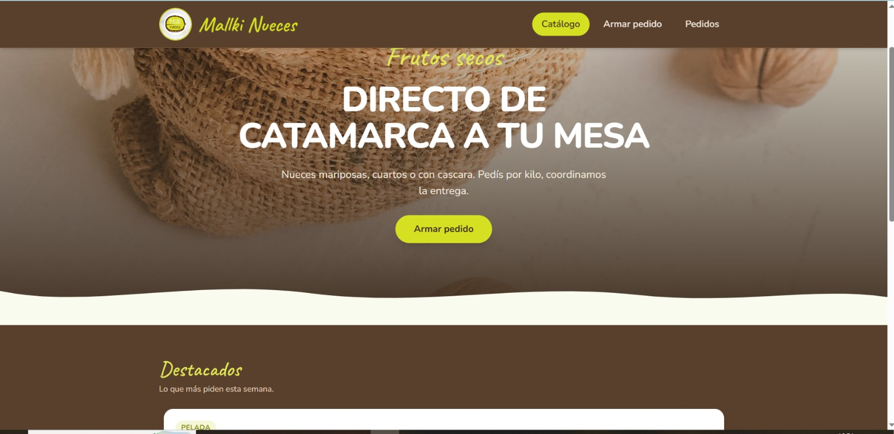
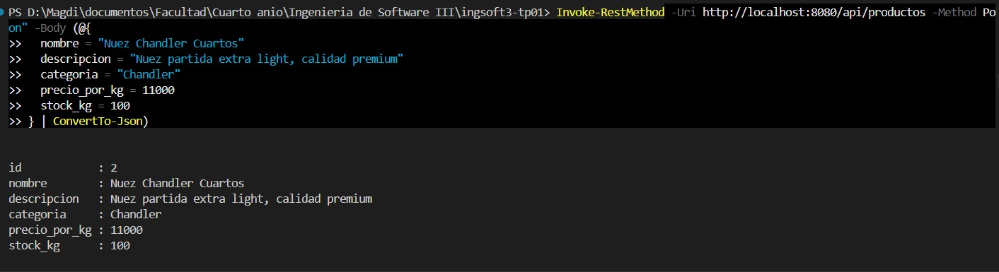
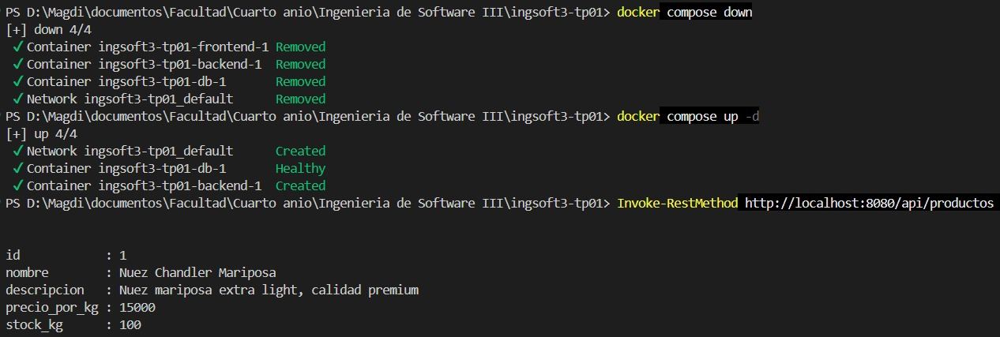
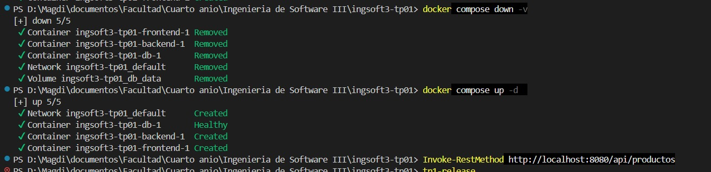
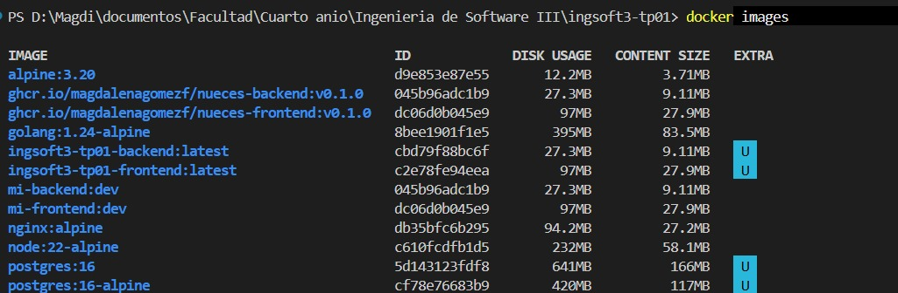
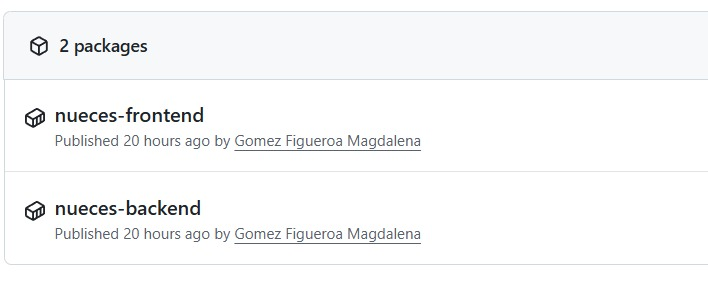

# Evidencias — Proyecto IngSoft3

## TP1 — Control de versiones

## 1. Push directo a main rechazado

GitHub rechaza el push porque `main` está protegida y la regla alcanza también al dueño del repo.

## 2. El PR de la rama B no se puede mergear: conflicto

GitHub avisa que no puede combinar automáticamente `feature/titulo-b` con `main`.

## 3. Marcadores del conflicto

El editor de GitHub muestra `<<<<<<<`, `=======` y `>>>>>>>` delimitando el contenido en conflicto.

## 4. Release v1.0.0 publicada

La release `v1.0.0`, publicada desde la pestaña Releases del repositorio.

## TP2 — Contenedores

### 1. Sistema completo funcionando (docker compose)

Los tres servicios (`db`, `backend`, `frontend`) arriba con `docker compose ps`, con `db` en estado `healthy`.

El catálogo en `http://localhost:3000`, sirviendo productos reales desde el backend dockerizado — no
código corriendo suelto, todo desde contenedores.

### 2. Prueba de persistencia

Se crea un producto vía la API, con el sistema ya levantado por `docker compose`.

Tras `docker compose down` seguido de `docker compose up`, el producto sigue existiendo — el volumen
(`db_data`) persiste aunque los contenedores se recreen.

Tras `docker compose down -v`, el producto desaparece — `-v` borra también el volumen, y Postgres
arranca de cero.

### 3. Comparación de tamaño de imagen (multi-stage)

| | Compila (SDK/build) | Final (runtime) |
|---|---|---|
| Backend | `golang:1.24-alpine` — 83.5MB | `nueces-backend:v0.1.0` — **9.11MB** |
| Frontend | `node:22-alpine` — 58.1MB | `nueces-frontend:v0.1.0` — **27.9MB** |

El SDK de Go nunca viaja a producción: la imagen final del backend pesa menos del 11% de la imagen que la compila.

### 4. Imágenes publicadas en ghcr.io

`nueces-backend` y `nueces-frontend`, publicadas como packages públicos en GitHub.