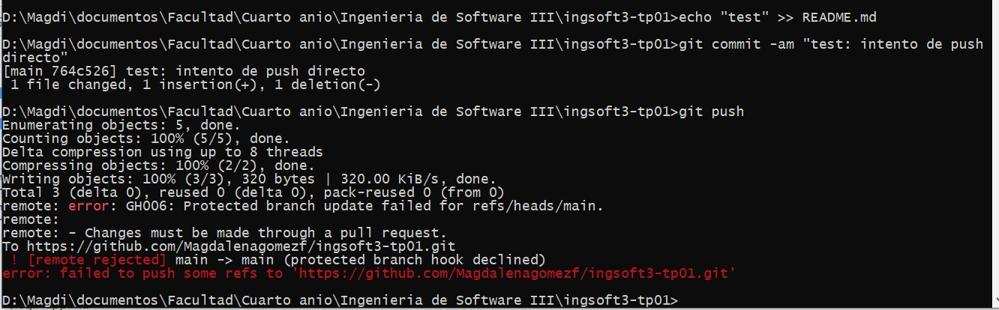
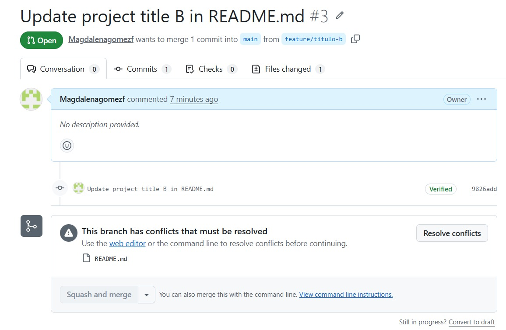
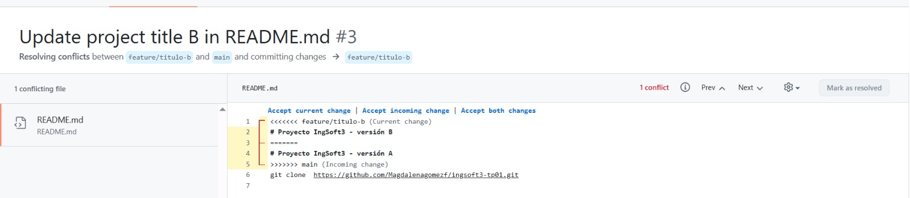
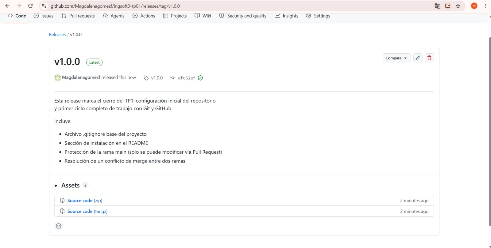

# Evidencias — TP1

## 1. Push directo a main rechazado

GitHub rechaza el push porque `main` está protegida y la regla alcanza también al dueño del repo.

## 2. El PR de la rama B no se puede mergear: conflicto

GitHub avisa que no puede combinar automáticamente `feature/titulo-b` con `main`.

## 3. Marcadores del conflicto

El editor de GitHub muestra `<<<<<<<`, `=======` y `>>>>>>>` delimitando el contenido en conflicto.

## 4. Release v1.0.0 publicada

La release `v1.0.0`, publicada desde la pestaña Releases del repositorio.